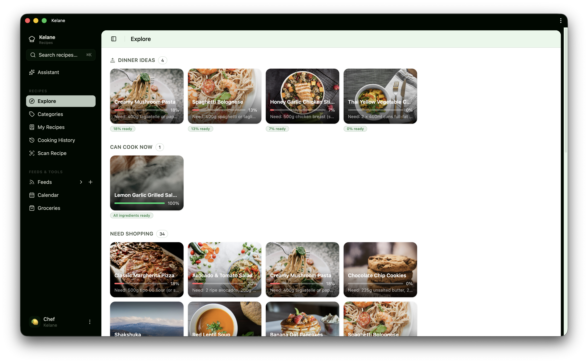

# Kelane

## Project Structure Overview
This template provides a robust foundation for a modern SPA. Understanding the file layout is key to development:

*   **`src/`**: Core application source code. Components and primary logic reside here.
*   **`public/`**: Contains static assets that are served directly (e.g., `index.html`, favicon).
*   **`dist/`**: The final, production-optimized build output directory.
*   **`data/`**: Intended for static data sets or cached resources.
*   **`mock/`**: Used for creating isolated mock API responses for frontend testing.

## 🛠️ Key Configuration Files
*   **`package.json`**: Defines scripts (`dev`, `build`) and manages project dependencies.
*   **`vite.config.js`**: Configures the Vite build tool, handling plugins and build targets.
*   **`eslint.config.js`**: Enforces code quality and style guidelines across the codebase.

This structure supports rapid development with React and Vite, while providing clear separation between source code, static assets, and build outputs.
